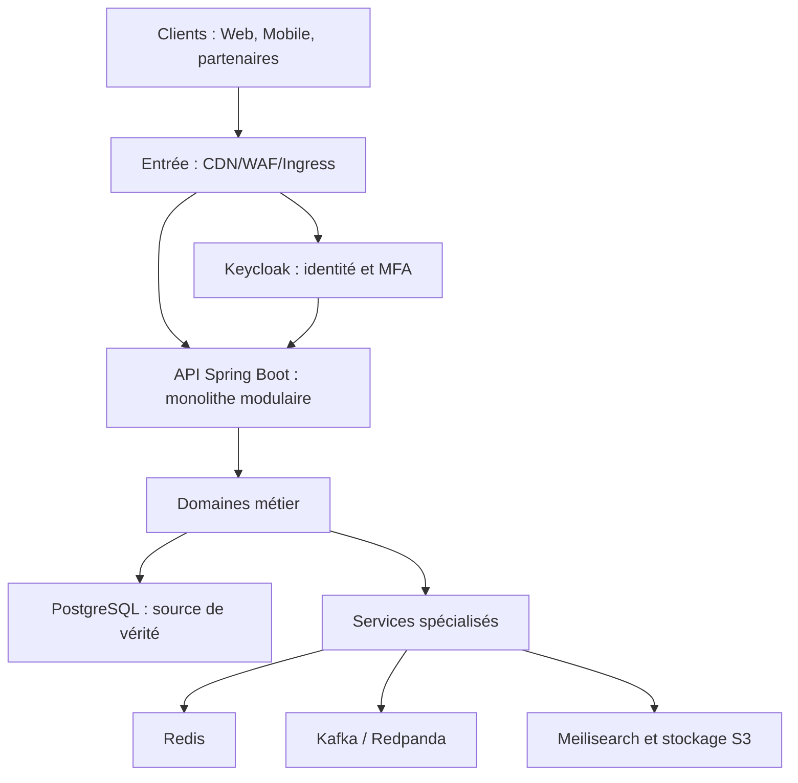
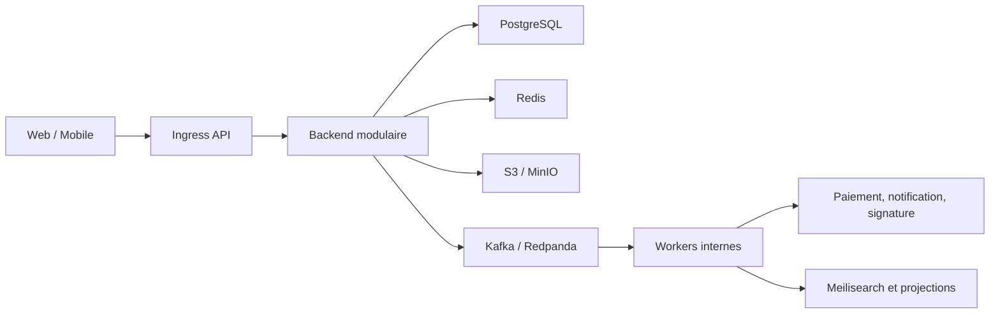
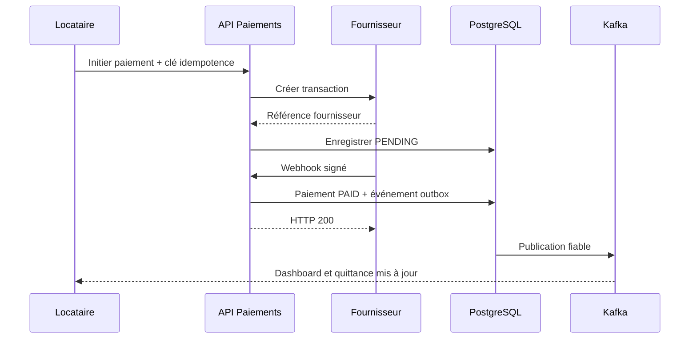

# Backlog – Plateforme de Gestion de Location
### (Maison / Appartement / Studio / Chambre simple / Chambre avec SDB)

---

## 1. Personas

| Persona | Description |
|---|---|
| **Propriétaire** | Possède un ou plusieurs biens, gère locataires, contrats, paiements. |
| **Locataire** | Occupe un bien, paie un loyer, peut résilier, signale des problèmes. |
| **Futur locataire (prospect)** | Recherche un bien, visite, réserve, signe un contrat. |
| **Administrateur plateforme** | Supervise l'ensemble des propriétaires/locataires, modère, gère les litiges globaux. |

---

## 2. User Stories existantes — reformulées (format INVEST + critères d'acceptation)

### Épique A — Gestion des biens et locataires (Propriétaire)

**US-01 — Liste des clients/locataires**
> En tant que propriétaire, je veux consulter la liste de tous mes locataires (actuels et anciens), afin de suivre mon portefeuille de clients.
- Critères d'acceptation : filtres (actif/résilié), recherche par nom/téléphone, export CSV.

**US-02 — Liste des biens/chambres en location**
> En tant que propriétaire, je veux consulter la liste de mes biens (maison, appartement, studio, chambre) avec leur statut (libre, occupé, en travaux), afin de piloter mon parc immobilier.
- Critères d'acceptation : statut mis à jour en temps réel, filtre par type/adresse/prix.

**US-03 — Suivi des paiements**
> En tant que propriétaire, je veux voir la liste des loyers payés/impayés par bien et par locataire, afin d'identifier rapidement les retards.
- Critères d'acceptation : code couleur (payé/en retard/partiel), historique par locataire.

**US-04 — Dashboard financier**
> En tant que propriétaire, je veux un dashboard synthétique (taux d'occupation, revenus encaissés, impayés, échéances à venir) mis à jour en temps réel, afin de piloter mon activité.
- Critères d'acceptation : graphiques (mensuel/hebdo), alertes visuelles sur impayés >X jours.

**US-05 — Configuration du mode de paiement**
> En tant que propriétaire, je veux définir la périodicité de paiement par bien (journalier, hebdomadaire, mensuel — mensuel par défaut), afin d'adapter la facturation au type de location.
- Critères d'acceptation : génération automatique des échéances selon la périodicité choisie ; impossible de changer la périodicité sur un contrat déjà signé sans avenant.

**US-06 — Informations locataires**
> En tant que propriétaire, je veux enregistrer email, téléphone et CNI de chaque locataire, afin de pouvoir le relancer (email/SMS/WhatsApp/Telegram/Signal) et disposer d'une pièce d'identité en cas de résiliation ou litige.
- Critères d'acceptation : champs obligatoires à la création du dossier, chiffrement des données sensibles (CNI), consentement RGPD/loi locale sur les données personnelles collecté et tracé.

### Épique B — Recherche & découverte (Futur locataire)

**US-07 — Fiche du bien**
> En tant que futur locataire, je veux consulter la fiche d'un bien (dimensions, prix, adresse physique et géolocalisée, type : chambre simple / appartement meublé ou non / maison meublée ou non), afin de décider si le bien correspond à mes besoins.
- Critères d'acceptation : carte interactive, filtres de recherche (prix, ville, type, meublé/non meublé).

**US-08 — Prise de rendez-vous / visite**
> En tant que futur locataire, je veux fixer un rendez-vous de visite en ligne, afin de vérifier les informations avant engagement.
- Critères d'acceptation : calendrier de disponibilités du propriétaire, confirmation automatique par email/SMS, rappel 24h avant.

**US-09 — Médias du bien**
> En tant que futur locataire, je veux voir photos et/ou vidéos du bien, afin d'évaluer son état sans déplacement.
- Critères d'acceptation : minimum 3 photos requises à la publication, upload vidéo (limite de taille définie), galerie zoomable.

**US-10 — Coordonnées du propriétaire**
> En tant que futur locataire, je veux accéder aux coordonnées (ou à une messagerie sécurisée) du propriétaire, afin de faire mon choix et le contacter.
- Critères d'acceptation : messagerie interne pour protéger les numéros tant que le contrat n'est pas signé (anti-fraude/anti-désintermédiation).

### Épique C — Contrat, caution, résiliation

**US-11 — Résiliation anticipée**
> En tant que locataire, je veux pouvoir résilier mon contrat avant échéance en payant une pénalité clairement définie, afin de sortir du contrat en toute transparence.
- Critères d'acceptation : montant/mode de calcul de la pénalité affiché avant signature du contrat, génération d'un avenant de résiliation.

**US-12 — Modalités de caution**
> En tant que futur locataire, je veux connaître le montant de la caution et le nombre de mois couverts (≤ 3 mois), afin de budgétiser mon entrée dans les lieux.
- Critères d'acceptation : simulateur de caution selon le loyer, validation bloquant toute saisie > 3 mois.

**US-13 — Règles contractuelles de caution et dégâts**
> En tant que propriétaire, je veux décrire les règles du contrat (gestion des dégâts, caution, incidents indépendants du locataire), afin de prévenir les litiges.
- Règles métier :
  - Si coût réparation ≤ caution → délta remboursé au locataire à la résiliation.
  - Si coût réparation > caution → réparation à la charge du locataire ; aucune caution restituée à la résiliation.
  - Si problème indépendant du locataire (plomberie, électricité...) → enregistré dans un registre d'incidents du bien, non imputable au locataire.
- Critères d'acceptation : état des lieux d'entrée/sortie avec photos horodatées, workflow de validation du montant des réparations par les deux parties (ou arbitrage admin en cas de désaccord).

---

## 3. Nouvelles User Stories — **Must Have** avant démarrage du projet

Ces user stories sont indispensables au fonctionnement même de la plateforme (socle technique et métier) et ne figuraient pas explicitement dans le backlog initial.

### Socle technique / sécurité
1. **US-14 (Must)** — En tant qu'utilisateur (propriétaire/locataire), je veux m'inscrire et me connecter de façon sécurisée (email/téléphone + mot de passe, ou OTP SMS), afin d'accéder à mon espace personnel.
2. **US-15 (Must)** — En tant qu'utilisateur, je veux réinitialiser mon mot de passe et activer une authentification à deux facteurs, afin de sécuriser mon compte.
3. **US-16 (Must)** — En tant qu'administrateur, je veux gérer les rôles et permissions (propriétaire, locataire, admin, éventuel gestionnaire délégué), afin de contrôler les accès aux données.
4. **US-17 (Must)** — En tant qu'utilisateur, je veux que mes données personnelles (CNI, coordonnées) soient stockées de façon chiffrée et conformes à la réglementation locale sur la protection des données, afin de garantir ma confidentialité.

### Paiement
5. **US-18 (Must)** — En tant que locataire, je veux payer mon loyer en ligne (Mobile Money : Orange Money, Wave, Free Money, ou carte bancaire), afin d'éviter les paiements en espèces et sécuriser la traçabilité.
6. **US-19 (Must)** — En tant que propriétaire, je veux recevoir une notification en temps réel dès qu'un paiement est effectué, afin de mettre à jour instantanément mon tableau de bord.
7. **US-20 (Must)** — En tant que propriétaire, je veux qu'un système de relance automatique (email + SMS/WhatsApp) soit déclenché X jours avant et après échéance impayée, afin de réduire le taux d'impayés sans action manuelle.
8. **US-21 (Must)** — En tant que propriétaire, je veux générer une quittance de loyer automatiquement après chaque paiement, afin de fournir une preuve légale au locataire.

### Contrat & documents
9. **US-22 (Must)** — En tant que propriétaire et locataire, je veux signer électroniquement le contrat de location (signature électronique + horodatage), afin de formaliser l'engagement sans déplacement.
10. **US-23 (Must)** — En tant qu'utilisateur, je veux stocker et télécharger mes documents (contrat, CNI, quittances, état des lieux) dans un espace documentaire personnel, afin d'y accéder à tout moment.

### Réservation & disponibilité
11. **US-24 (Must)** — En tant que futur locataire, je veux réserver un bien en ligne avec verrouillage temporaire de la disponibilité (ex. 24h), afin d'éviter qu'un autre prospect ne réserve le même bien en même temps (anti double-booking, cohérence temps réel).
12. **US-25 (Must)** — En tant que propriétaire, je veux publier/dépublier un bien et mettre à jour son statut en temps réel, afin que les prospects ne voient que des biens réellement disponibles.

### Confiance & qualité de service
13. **US-26 (Should)** — En tant que locataire, je veux laisser un avis/note sur un bien et un propriétaire (et inversement), afin d'améliorer la confiance sur la plateforme.
14. **US-27 (Must)** — En tant qu'utilisateur, je veux un système de messagerie interne (chat) en temps réel avec le propriétaire/locataire, afin de communiquer sans exposer mes coordonnées personnelles avant signature.
15. **US-28 (Should)** — En tant qu'administrateur, je veux un module de gestion des litiges (réparations contestées, caution non restituée), afin d'arbitrer les conflits de façon traçable.

### Observabilité / exploitation
16. **US-29 (Must)** — En tant qu'administrateur technique, je veux un tableau de bord de supervision (paiements en échec, jobs de notification en erreur, disponibilité des services), afin de garantir la continuité de service.
17. **US-30 (Should)** — En tant qu'utilisateur, je veux que l'application fonctionne en français et dans une autre langue locale (ex. anglais/wolof selon le marché cible), afin d'être accessible au plus grand nombre.

---

## 4. Proposition de Stack Full-Stack (tolérance aux pannes, temps réel, scalabilité)

> **Stack retenue à l'issue du benchmark comparatif** (Spring Boot + React vs Full Elixir vs Fullstack Django vs Fullstack Flask) : **Spring Boot (backend) + ReactJS/TailwindCSS (frontend)**, pour son équilibre entre fiabilité outillée, écosystème d'intégrations, richesse UX et facilité de recrutement.

### 4.1 Vue d'ensemble

| Couche | Technologie proposée | Justification |
|---|---|---|
| **Frontend Web** | ReactJS + TypeScript + TailwindCSS via Vite | SPA légère, développement rapide, contrôle total de l'UX locataire/propriétaire et composants réutilisables |
| **Frontend Mobile** | React Native | Partage de composants/logique avec le frontend web React, accès aux notifications push natives |
| **API Gateway** | Spring Cloud Gateway (ou Kong/NGINX) + rate limiting | Point d'entrée unique, sécurité, throttling anti-abus, routage vers les modules/microservices |
| **Backend** | **Spring Boot 3 / Java 21**, architecture en monolithe modulaire organisé par bounded contexts, extractible en microservices uniquement si des critères mesurés le justifient | Écosystème Java mature, transactions simples au MVP et frontières métier explicites |
| **Modèle d'exécution** | Spring MVC impératif avec JPA ; WebSocket/STOMP uniquement pour le temps réel | Modèle homogène et maintenable ; WebFlux ne sera introduit que par une décision d'architecture fondée sur des mesures |
| **Base de données principale** | PostgreSQL (réplication streaming + Patroni pour le failover automatique), accès via Spring Data JPA / Hibernate | Transactions ACID indispensables pour paiements/contrats ; Spring Data simplifie fortement le CRUD |
| **Cache & sessions** | Redis (Cluster mode), intégré via Spring Data Redis | Sessions, cache des recherches, pub/sub pour la diffusion temps réel |
| **Recherche de biens** | Meilisearch, alimenté de façon asynchrone depuis PostgreSQL | Recherche full-text et filtres rapides sans multiplier les technologies ni créer une seconde source de vérité |
| **Stockage fichiers** | S3-compatible (AWS S3 ou MinIO auto-hébergé) + CDN (CloudFront/Cloudflare), intégration via AWS SDK for Java | Photos/vidéos des biens, contrats PDF, CNI chiffrées |
| **File d'attente / événements** | Apache Kafka (via Spring Kafka) ou RabbitMQ (via Spring AMQP) | Découplage des notifications, paiements asynchrones, relances automatiques, rejouabilité des événements |
| **Temps réel** | WebSocket via **Spring WebSocket + STOMP** (ou Server-Sent Events pour les flux simples), diffusion multi-instance appuyée sur Redis Pub/Sub | Dashboard live, chat propriétaire/locataire, disponibilité des biens en temps réel, cohérence même avec plusieurs instances backend derrière le load balancer |
| **Paiement** | Intégration Mobile Money (Orange Money, Wave, Free Money via agrégateur type PayDunya/CinetPay) + Stripe pour cartes internationales, appelés via `RestClient`/`WebClient` Spring avec `resilience4j` | Couvre le contexte local et international, avec résilience sur les appels sortants |
| **Notifications** | Twilio (SMS + WhatsApp Business API), SendGrid/Mailgun (email), Firebase Cloud Messaging (push), orchestrées via des consumers Kafka | Multi-canal comme demandé dans le backlog, découplé du flux principal (non bloquant) |
| **Signature électronique** | DocuSign API / Yousign (plus adapté Afrique francophone) | Signature légale des contrats |
| **Authentification** | **Spring Security** + Keycloak (OAuth2/OIDC) — JWT + refresh tokens, 2FA | Gestion centralisée des identités et rôles, intégration native et éprouvée avec Spring |

### 4.2 Infrastructure & Tolérance aux pannes

- **Orchestration** : Kubernetes (managé — EKS/GKE ou solution locale) avec auto-scaling horizontal (HPA) sur les pods backend Spring Boot.
- **Multi-AZ / Multi-région** : déploiement sur au moins 2 zones de disponibilité ; réplicas PostgreSQL en lecture dans une autre zone, bascule automatique via Patroni + etcd.
- **Circuit breakers, retries, bulkhead & rate limiters** : **Resilience4j** (natif Spring Boot) sur tous les appels externes critiques (Mobile Money, SMS, signature électronique) — circuit breaker pour isoler un fournisseur en panne, retry avec backoff exponentiel, bulkhead pour éviter qu'un service lent ne sature tous les threads, fallback métier (ex. mise en file d'attente du paiement si le fournisseur Mobile Money est indisponible).
- **Idempotence des paiements** : clés d'idempotence sur chaque transaction (stockées en base) pour éviter les doubles débits en cas de retry réseau.
- **Dead-letter queue** : messages Kafka en échec répété routés vers une DLQ pour rejeu manuel ou automatique après investigation.
- **Sauvegardes** : backups PostgreSQL automatisés (point-in-time recovery), réplication cross-region pour le stockage des fichiers sensibles (contrats, CNI).
- **Health checks & self-healing** : **Spring Boot Actuator** (`/actuator/health`, `/actuator/metrics`) branché sur les liveness/readiness probes Kubernetes ; redémarrage automatique des pods défaillants.
- **Load balancing** : NGINX/Envoy en frontal, répartition de charge sur plusieurs instances Spring Boot ; sessions WebSocket rendues cohérentes multi-instance via Redis Pub/Sub (STOMP relay).
- **Graceful shutdown** : activation du `graceful shutdown` natif de Spring Boot pour terminer proprement les requêtes en cours lors des déploiements/rolling updates, évitant les pertes de transactions.

### 4.3 Observabilité

- **Monitoring** : Spring Boot Actuator + Micrometer exposant les métriques vers Prometheus + Grafana (métriques techniques et métier : taux d'impayés, latence paiement, taux d'erreur par intégration externe).
- **Logs centralisés** : stack ELK (Elasticsearch/Logstash/Kibana) ou Grafana Loki, logs structurés (JSON) via Logback.
- **Tracing distribué** : **Micrometer Tracing** (successeur de Spring Cloud Sleuth) + OpenTelemetry + Jaeger, pour suivre une requête à travers les modules (utile dès l'extraction en microservices).
- **Alerting** : Alertmanager / PagerDuty sur les incidents critiques (échec paiement en masse, panne base de données, ouverture d'un circuit breaker Resilience4j).

### 4.4 Sécurité

- HTTPS/TLS partout (Let's Encrypt), chiffrement au repos (AES-256) pour CNI et documents sensibles.
- **Spring Security** : gestion fine des rôles/permissions (propriétaire, locataire, admin), protection CSRF/XSS par défaut, validation des entrées (Bean Validation).
- WAF (Web Application Firewall) devant l'API Gateway.
- Rate limiting (Resilience4j / Spring Cloud Gateway) et protection anti-bot sur les endpoints de recherche/inscription.
- Journalisation des accès aux données sensibles (audit trail via Spring Data Envers ou solution dédiée) pour conformité RGPD/loi locale.

### 4.5 CI/CD

- GitHub Actions ou GitLab CI : build Maven/Gradle, tests automatisés (JUnit 5 + Testcontainers pour les tests d'intégration avec PostgreSQL/Kafka/Redis réels), tests frontend (Vitest/Jest + Playwright/Cypress e2e), build d'images Docker (Spring Boot + Buildpacks ou Dockerfile multi-stage), déploiement Kubernetes.
- Stratégie de déploiement **blue-green** ou **canary** pour éviter les interruptions de service lors des mises à jour.
- Environnements séparés : dev / staging / production, avec configuration externalisée via Spring Cloud Config ou variables Kubernetes (ConfigMap/Secrets).

---

## 5. Priorisation suggérée (MoSCoW résumé)

| Priorité | Contenu |
|---|---|
| **Must Have** | Auth/rôles, CRUD biens & locataires, paiement en ligne + quittance, dashboard temps réel, contrat signé électroniquement, réservation sans double-booking, messagerie temps réel, relances automatiques, sécurité des données (CNI, RGPD) |
| **Should Have** | Avis/notation, module litiges, multi-langue, export comptable |
| **Could Have** | Chatbot d'assistance, recommandations personnalisées de biens (matching), programme de fidélité |
| **Won't Have (v1)** | Marketplace de services annexes (déménagement, assurance habitation intégrée) |

---

## 6. Découpage en jalons de livraison (Dev → Prod)

Principe : chaque **jalon (J)** livre un **lot fonctionnel indépendamment testable** — d'abord validé en environnement de **Dev/Staging** (recette fonctionnelle + tests automatisés), puis promu en **Prod** une fois les critères de sortie remplis. Chaque jalon s'appuie sur le précédent (les fondations techniques du J0 sont un prérequis bloquant pour tous les autres).

### Vue synthétique

| Jalon | Objectif du lot | US couvertes | Testable seul(e) ? |
|---|---|---|---|
| **J0** | Fondations techniques & environnements | Socle infra, CI/CD, auth | Oui — santé technique de la plateforme |
| **J1** | Back-office propriétaire (cœur métier) | US-01, 02, 05, 06, 14, 15, 16, 17 | Oui — un propriétaire peut gérer ses biens/locataires |
| **J2** | Vitrine publique & découverte | US-07, 09, 10 | Oui — un prospect peut consulter des annonces publiées en J1 |
| **J3** | Prise de RDV & mise en relation | US-08, 27 (chat) | Oui — un prospect peut visiter/échanger avant de s'engager |
| **J4** | Contrat, caution, résiliation | US-12, 13, 22, 23, 11 | Oui — un contrat peut être signé et clôturé de bout en bout |
| **J5** | Paiement, quittances, suivi financier | US-03, 04, 18, 19, 21 | Oui — un locataire paie, le propriétaire suit ses encaissements |
| **J6** | Relances automatiques & notifications multi-canal | US-20, (canaux SMS/WhatsApp de US-06) | Oui — testable en simulant des échéances impayées |
| **J7** | Réservation temps réel & anti double-booking | US-24, 25 | Oui — testable avec 2 sessions concurrentes |
| **J8** | Confiance, litiges, qualité de service | US-26, 28, 30 | Oui — fonctionnalités additives, aucun impact sur le cœur |
| **J9** | Durcissement production (résilience, observabilité, montée en charge) | US-29 + non-fonctionnel transverse | Oui — validé par tests de charge/chaos avant ouverture large |

---

### J0 — Fondations techniques & environnements *(prérequis bloquant)*

**Objectif** : disposer d'un socle technique fiable avant tout développement fonctionnel.

**Contenu**
- Mise en place des environnements **Dev**, **Staging** et **Prod** (Kubernetes, bases de données, secrets).
- Pipeline CI/CD (build, tests automatisés, déploiement blue-green/canary).
- Authentification & gestion des rôles (US-14, US-15, US-16) sur Spring Security + Keycloak.
- Chiffrement des données sensibles et conformité RGPD/loi locale (US-17).
- Observabilité de base : Actuator + Prometheus/Grafana + logs centralisés.

**Critères de sortie Dev → Staging**
- Un utilisateur peut s'inscrire/se connecter avec 2FA sur les 3 environnements.
- Pipeline CI/CD vert (build + tests unitaires) sur chaque commit.

**Critères de sortie Staging → Prod**
- Health checks Actuator OK, dashboards Grafana actifs, backup PostgreSQL automatisé vérifié par un test de restauration.

---

### J1 — Back-office propriétaire (cœur métier)

**Objectif** : le propriétaire peut gérer intégralement son parc immobilier.

**Contenu** : US-01 (liste clients), US-02 (liste biens), US-05 (périodicité de paiement), US-06 (infos locataires + CNI).

**Scénario de test (Dev/Staging)**
- Un propriétaire crée un compte, ajoute 2 biens (dont un meublé, un non meublé), y associe des locataires avec CNI/email/téléphone, configure une périodicité mensuelle et une hebdomadaire.
- Vérification : les données CNI sont bien chiffrées en base.

**Critère de sortie vers Prod** : recette fonctionnelle validée par un propriétaire pilote + tests de non-régression automatisés (CRUD biens/locataires) au vert.

---

### J2 — Vitrine publique & découverte

**Objectif** : un futur locataire peut rechercher et consulter des annonces réellement publiées.

**Contenu** : US-07 (fiche du bien), US-09 (photos/vidéos), US-10 (coordonnées/messagerie propriétaire), moteur de recherche Meilisearch.

**Scénario de test** : un bien créé en J1 est publié, apparaît dans la recherche avec filtres (ville, prix, type), la fiche affiche photos et carte géolocalisée.

**Critère de sortie vers Prod** : temps de réponse recherche < 300 ms sous charge simulée, indexation à jour en < 1 min après publication d'un bien.

---

### J3 — Prise de RDV & mise en relation

**Objectif** : un prospect peut planifier une visite et échanger sans exposer ses coordonnées.

**Contenu** : US-08 (rendez-vous), US-27 (messagerie interne temps réel — première brique WebSocket).

**Scénario de test** : un prospect prend RDV sur un créneau du propriétaire, reçoit une confirmation, échange via le chat intégré (test avec 2 sessions simultanées pour valider le temps réel).

**Critère de sortie vers Prod** : latence du chat < 500 ms en Staging sous charge simulée (ex. 100 connexions WebSocket concurrentes).

---

### J4 — Contrat, caution, résiliation

**Objectif** : le parcours contractuel est end-to-end (signature → clôture).

**Contenu** : US-12 (caution ≤ 3 mois), US-13 (règles caution/dégâts + registre d'incidents), US-22 (signature électronique), US-23 (espace documentaire), US-11 (résiliation anticipée + pénalité).

**Scénario de test** : génération d'un contrat, simulation de signature électronique (sandbox Yousign/DocuSign), état des lieux avec photos horodatées, simulation d'un cas de dégât > caution puis d'un cas de dégât ≤ caution, vérification du calcul du delta remboursé.

**Critère de sortie vers Prod** : validation juridique du gabarit de contrat + tests des 3 scénarios de caution (delta remboursé / caution perdue / incident non imputable).

---

### J5 — Paiement, quittances, suivi financier

**Objectif** : le cycle de paiement est opérationnel et visible en temps réel.

**Contenu** : US-03 (liste payés/impayés), US-04 (dashboard temps réel), US-18 (paiement Mobile Money/carte), US-19 (notification instantanée propriétaire), US-21 (quittance automatique).

**Scénario de test (Dev/Staging, sandbox Mobile Money)**
- Paiement en sandbox Orange Money/Wave → mise à jour du dashboard en < 2 s (WebSocket) → quittance PDF générée automatiquement.
- Test de rejeu (double clic paiement) → vérification de l'idempotence (pas de double débit).
- Test du circuit breaker Resilience4j en coupant volontairement l'accès au fournisseur Mobile Money (chaos test léger).

**Critère de sortie vers Prod** : bascule vers les comptes marchands réels (hors sandbox), test de bout en bout avec un paiement réel à faible montant, alerting configuré sur échec de paiement en masse.

---

### J6 — Relances automatiques & notifications multi-canal

**Objectif** : réduction du taux d'impayés sans intervention manuelle.

**Contenu** : US-20 (relances auto email/SMS/WhatsApp avant/après échéance).

**Scénario de test** : création d'échéances fictives dans le passé (Dev) → vérification du déclenchement des relances via Kafka consumers → vérification de la non-duplication des envois.

**Critère de sortie vers Prod** : intégration Twilio/SendGrid en mode production (quotas réels), test de charge sur un volume simulé de 1000 relances/jour sans perte de message (DLQ vérifiée).

---

### J7 — Réservation temps réel & anti double-booking

**Objectif** : cohérence garantie de la disponibilité des biens.

**Contenu** : US-24 (verrouillage temporaire à la réservation), US-25 (statut temps réel biens publiés/dépubliés).

**Scénario de test** : 2 prospects tentent de réserver le même bien en simultané (test de concurrence) → un seul aboutit, l'autre reçoit un statut "indisponible" en temps réel sans rechargement de page.

**Critère de sortie vers Prod** : test de concurrence automatisé (ex. 50 requêtes simultanées) sans incohérence de statut.

---

### J8 — Confiance, litiges, qualité de service *(Should Have)*

**Objectif** : enrichir la confiance sans risque sur le cœur applicatif.

**Contenu** : US-26 (avis/notation), US-28 (module litiges/arbitrage admin), US-30 (multi-langue).

**Scénario de test** : dépôt d'un avis après résiliation d'un contrat (J4), ouverture d'un litige sur une caution contestée, bascule de langue de l'interface.

**Critère de sortie vers Prod** : fonctionnalités additives déployables indépendamment (feature flag), sans dépendance bloquante sur les jalons précédents.

---

### J9 — Durcissement production (résilience, observabilité, montée en charge)

**Objectif** : valider que la plateforme tient la charge réelle avant ouverture commerciale large.

**Contenu** : US-29 (dashboard de supervision technique) + non-fonctionnel transverse (multi-AZ, chaos engineering, revue de sécurité).

**Scénario de test**
- Test de charge (ex. k6/Gatling) simulant le pic d'usage attendu (recherche, paiement, chat simultanés).
- Chaos test : coupure volontaire d'un pod backend, d'une réplique PostgreSQL → vérification du failover automatique (Patroni) sans perte de transaction.
- Audit de sécurité (pen test léger) sur l'authentification et le stockage des CNI.

**Critère de sortie vers Prod (ouverture large)** : SLA de disponibilité défini et tenu en Staging (ex. 99,5 %), RTO/RPO validés sur un exercice de restauration complète.

---

### Cadence de promotion Dev → Staging → Prod (par jalon)

1. **Dev** : développement + tests unitaires/intégration (Testcontainers) au vert.
2. **Staging** : recette fonctionnelle (scénario de test du jalon) + tests de charge ciblés + revue de sécurité légère.
3. **Prod** : déploiement canary (5-10 % du trafic) → surveillance des métriques clés (Grafana/Alertmanager) pendant 24-48h → généralisation si aucun incident, sinon rollback automatique.

---

## 7. Infrastructure de l'environnement de Dev — Containerisation des outils

**Objectif** : permettre à n'importe quel développeur de lancer **la totalité des dépendances de la plateforme en local**, avec une seule commande (`docker compose up`), sans installer manuellement PostgreSQL, Kafka, Redis, etc. sur sa machine. L'environnement de Dev doit **refléter fidèlement les composants de Prod** (même nature de service), mais dans des versions légères/mono-nœud et avec des données/comptes de test (sandbox).

### 7.1 Principe d'architecture

- **Orchestrateur local** : Docker Compose (suffisant en Dev ; Kubernetes reste réservé à Staging/Prod — cf. section 4.2).
- **Un réseau Docker dédié** (`location_dev_net`) reliant tous les conteneurs.
- **Volumes nommés** pour persister les données entre redémarrages (Postgres, Redis, MinIO, Kafka).
- **Fichier `.env`** centralisant tous les identifiants/mots de passe de dev (jamais les mêmes qu'en Prod).
- **Health checks** sur chaque service pour que le backend Spring Boot ne démarre qu'une fois ses dépendances réellement prêtes (`depends_on: condition: service_healthy`).
- **Mocks/sandbox pour les services externes payants** (Mobile Money, SMS) afin de développer/tester sans consommer de crédits réels.

### 7.2 Tableau des outils containerisés

| Outil / Service | Image Docker | Rôle en Dev | Port exposé | Équivalent Prod (section 4) |
|---|---|---|---|---|
| **PostgreSQL** | `postgres:16-alpine` | Base de données principale | 5432 | PostgreSQL + Patroni (HA) |
| **Redis** | `redis:7-alpine` | Cache, sessions, Pub/Sub WebSocket | 6379 | Redis Cluster |
| **Redpanda** (Kafka-compatible) | `redpandadata/redpanda` | Broker d'événements (léger, mono-nœud, API Kafka) | 9092 | Apache Kafka (cluster) |
| **Redpanda Console** | `redpandadata/console` | UI pour inspecter les topics/messages Kafka en dev | 8090 | Kafka UI / Grafana |
| **Keycloak** | `quay.io/keycloak/keycloak` | Authentification OAuth2/OIDC, gestion des rôles | 8081 | Keycloak (HA, base dédiée) |
| **Meilisearch** | `getmeili/meilisearch` | Moteur de recherche des biens (léger, rapide à démarrer) | 7700 | Meilisearch dimensionné et répliqué selon la charge |
| **MinIO** | `minio/minio` | Stockage S3-compatible (photos, vidéos, contrats, CNI) | 9000 / 9001 (console) | AWS S3 / MinIO distribué |
| **MailHog** | `mailhog/mailhog` | Capture les emails envoyés en dev (au lieu de SendGrid réel) | 8025 (UI) / 1025 (SMTP) | SendGrid / Mailgun |
| **WireMock** | `wiremock/wiremock` | Simule les APIs externes (Mobile Money, SMS Twilio, signature électronique) en mode sandbox | 8082 | Vrais fournisseurs (Orange Money, Wave, Twilio, Yousign) |
| **Adminer** | `adminer` | Interface web légère d'administration PostgreSQL | 8083 | pgAdmin / outils internes |
| **Jaeger** | `jaegertracing/all-in-one` | Visualisation du tracing distribué en dev | 16686 | Jaeger (déploiement cluster) |
| **Prometheus** | `prom/prometheus` | Collecte des métriques Actuator/Micrometer en dev | 9090 | Prometheus (HA) |
| **Grafana** | `grafana/grafana` | Dashboards de métriques en dev | 3001 | Grafana (HA) |
| **Backend Spring Boot** | Build local (`Dockerfile` multi-stage) | API applicative | 8080 | Pods Spring Boot (Kubernetes) |
| **Frontend React** | Build local (Node + Vite dev server, ou Nginx pour un mode "preview prod") | Interface web | 5173 (dev) | Build statique servi via CDN/Nginx |

> **Remarque** : Redpanda est proposé à la place d'un vrai cluster Kafka + Zookeeper en Dev car il expose la même API Kafka avec un seul conteneur, beaucoup plus léger à faire tourner sur un poste de développeur. Le code applicatif (Spring Kafka) reste identique entre Dev (Redpanda) et Prod (Kafka).

### 7.3 Exemple de `docker-compose.dev.yml`

Un fichier `docker-compose.dev.yml` prêt à l'emploi est fourni ci-dessous (voir fichier livré séparément). Il permet de démarrer tout l'environnement avec :

```bash
docker compose -f docker-compose.dev.yml up -d
```

et de l'arrêter avec :

```bash
docker compose -f docker-compose.dev.yml down -v   # -v pour repartir de données vierges
```

### 7.4 Tests automatisés et containerisation (lien avec la CI)

- **Testcontainers** (déjà mentionné en section 4.5) : les tests d'intégration Spring Boot démarrent leurs **propres conteneurs éphémères** (PostgreSQL, Kafka, Redis) via Testcontainers, indépendamment du `docker-compose.dev.yml` utilisé pour le développement manuel — garantissant des tests reproductibles en CI (GitHub Actions/GitLab CI) sans dépendre d'un environnement partagé.
- Le pipeline CI construit également l'image Docker du backend (`Dockerfile` multi-stage : build Maven puis image runtime légère type `eclipse-temurin:21-jre-alpine`) et du frontend, images ensuite poussées vers un registre (GitHub Container Registry / Docker Hub privé) avant déploiement Staging/Prod.

### 7.5 Bonnes pratiques associées

- **Un seul point d'entrée** pour démarrer l'environnement (`docker compose up` ou `make dev-up` via un `Makefile` wrapper) afin de réduire la friction d'onboarding des nouveaux développeurs.
- **Données de test (seed)** : script d'initialisation (SQL ou Spring Boot `CommandLineRunner` conditionné au profil `dev`) injectant des propriétaires, biens et locataires fictifs dès le premier démarrage.
- **Isolation des secrets** : `.env` de dev versionné en exemple (`.env.example`), jamais le vrai `.env` ; secrets de Prod gérés séparément (Kubernetes Secrets / Vault), jamais dans les images Docker.
- **Parité Dev/Prod** (principe des *12-factor apps*) : mêmes noms d'images de base (Postgres, Redis) qu'en Prod, seules la topologie (mono-nœud vs cluster/HA) et la taille des ressources diffèrent.

---

## 8. Priorisation MVP vs jalons suivants (finalité du projet)

**Finalité du projet** : digitaliser la boucle complète de location — *recherche du bien → mise en relation → contrat → paiement → suivi* — pour réduire les impayés, sécuriser les propriétaires et fluidifier l'expérience des locataires. Le **MVP** doit valider cette boucle de bout en bout avec un **cœur minimal mais réellement exploitable en conditions réelles** ; les jalons suivants apportent l'automatisation, le confort d'usage et la robustesse à l'échelle.

### 8.1 MVP — cœur indispensable pour une mise en location réelle

Le MVP correspond aux **jalons J0 à J5**, avec certaines US volontairement simplifiées pour aller vite sans sacrifier la fiabilité sur les flux critiques (paiement, contrat, données personnelles).

| Jalon | US incluses au MVP | Niveau |
|---|---|---|
| **J0** | US-14, US-15, US-16, US-17 (auth, rôles, chiffrement/RGPD) | ✅ Intégral — non négociable, bloquant pour tout le reste |
| **J1** | US-01, US-02, US-05, US-06 (CRUD biens/locataires, périodicité, CNI) | ✅ Intégral — cœur métier propriétaire |
| **J2** | US-07, US-09 (fiche bien, photos/vidéos) | ✅ Intégral — sans annonce visible, pas de demande |
| **J2** | US-10 (coordonnées propriétaire) | ⚠️ **Simplifié** : mise en relation par formulaire de contact simple (email/téléphone visibles après demande), sans messagerie temps réel complète |
| **J3** | US-08 (prise de RDV) | ⚠️ **Simplifié** : formulaire de demande de créneau + confirmation manuelle par le propriétaire (pas de calendrier synchronisé avancé) |
| **J4** | US-12, US-13 (caution ≤ 3 mois, règles dégâts/incidents) | ✅ Intégral — indispensable pour la confiance contractuelle |
| **J4** | US-22 (signature électronique) | ⚠️ **Simplifié** : génération du contrat en PDF téléchargeable + case "j'accepte" horodatée (traçabilité minimale), intégration d'un vrai prestataire de signature électronique (Yousign/DocuSign) différée en V1.1 |
| **J4** | US-23 (espace documentaire) | ✅ Intégral |
| **J4** | US-11 (résiliation anticipée) | ✅ Intégral |
| **J5** | US-03, US-04, US-18, US-19, US-21 (paiement, dashboard, quittance) | ✅ Intégral — c'est le **cœur de la proposition de valeur** (réduire les impayés / sécuriser l'encaissement) |

**US exclues volontairement du MVP** (reportées) : US-20 (relances automatiques), US-24/US-25 (réservation temps réel anti double-booking — remplacée en MVP par une validation manuelle du propriétaire), US-27 (chat temps réel — remplacé par le formulaire de contact simplifié ci-dessus), US-26, US-28, US-29, US-30.

> **Pourquoi ces simplifications ?** Elles concernent des mécanismes de **confort ou d'automatisation** (chat temps réel, relances auto, verrouillage concurrentiel de réservation) qui apportent de la valeur mais ne sont pas indispensables pour **prouver que la boucle métier fonctionne** avec un nombre limité d'utilisateurs pilotes. À faible volume, une confirmation manuelle du propriétaire suffit à éviter un double-booking ; à plus grande échelle (post-MVP), l'automatisation temps réel devient nécessaire.

### 8.2 Jalons suivants — montée en valeur et en robustesse

| Version | Jalon(s) | US | Objectif |
|---|---|---|---|
| **V1.1** | J3 (finalisation) | US-27 (messagerie interne temps réel) | Remplacer le formulaire de contact par un vrai chat temps réel, protégeant les coordonnées jusqu'à la signature |
| **V1.1** | J4 (finalisation) | Intégration réelle de la signature électronique (Yousign/DocuSign) en remplacement du PDF "j'accepte" du MVP | Renforcer la valeur juridique du contrat |
| **V1.1** | J6 | US-20 (relances automatiques multi-canal) | Réduire le taux d'impayés sans action manuelle du propriétaire — gain de valeur direct une fois un volume réel de locataires atteint |
| **V1.2** | J7 | US-24, US-25 (réservation temps réel, anti double-booking) | Nécessaire dès que le volume de prospects simultanés rend la validation manuelle insuffisante |
| **V1.2** | J8 | US-26 (avis/notation), US-28 (litiges) | Renforcer la confiance et professionnaliser la gestion des conflits à mesure que la base d'utilisateurs grandit |
| **V2** | J8 (suite) | US-30 (multi-langue) | Extension à de nouveaux marchés/audiences |
| **V2 / continu** | J9 | US-29 + durcissement non-fonctionnel (chaos engineering, multi-AZ complet, audit de sécurité) | À mener progressivement dès que le trafic réel justifie l'investissement en résilience à grande échelle (les bases — Resilience4j, health checks, backups — restent actives dès le MVP, mais les tests de charge/chaos complets sont un jalon dédié) |

### 8.3 Lecture rapide

- **Le MVP ne sacrifie jamais** : la sécurité des données (CNI/RGPD), la fiabilité du paiement, et la clarté contractuelle (caution, dégâts, résiliation) — ce sont les points de rupture de confiance les plus coûteux à corriger a posteriori.
- **Le MVP simplifie volontairement** : tout ce qui relève de l'automatisation ou du temps réel "de confort" (chat, relances auto, anti double-booking), remplaçable par une action manuelle du propriétaire à faible volume.
- **Les jalons suivants** rendent la plateforme **auto-suffisante** (moins d'intervention manuelle du propriétaire) puis **prête à l'échelle** (résilience, confiance communautaire, internationalisation).

---

## 9. Choix d'architecture, propriété des tables et arborescence Java

### 9.1 Décision retenue

Le backend est un **monolithe modulaire Spring Boot 3 / Java 21**, sans Spring Modulith. Il suit une organisation `package-by-feature` correspondant aux bounded contexts. PostgreSQL est l'unique base transactionnelle et chaque contexte persistant possède, ou possédera lors de son implémentation, son schéma, ses tables et ses migrations Flyway.

Les modules CRUD utilisent des couches classiques allégées. Les domaines ayant des règles sensibles, de la concurrence ou plusieurs intégrations utilisent une architecture hexagonale. Aucun module ne lit le repository d'un autre module. Les échanges se font par façade applicative publique ou événement métier.

### 9.2 Correspondance entre le draft SQL et les bounded contexts

| Table du draft | Table PostgreSQL cible | Bounded context | Statut |
|---|---|---|---|
| `utilisateurs` | `identites.utilisateur`, `identites.utilisateur_role`, `identites.consentement` | `identites` | Validé |
| `maisons` | `biens.bien_immobilier` | `biens` | Validé |
| `chambres` | `biens.unite_locative`, `biens.equipement`, `biens.unite_equipement` | `biens` | Validé |
| `medias` | `biens.media` | `biens` | Validé |
| `contrats` | `contrats.contrat`, `contrats.caution`, `contrats.avenant`, `contrats.signature_contrat`, `contrats.etat_des_lieux` | `contrats` | Validé |
| `paiements` | `paiements.echeance`, `paiements.paiement`, `paiements.affectation_paiement`, `paiements.operation_fournisseur`, `paiements.remboursement`, `paiements.quittance` | `paiements` | Validé |
| `rendez_vous` | `visites.creneau_visite`, `visites.demande_visite`, `visites.historique_visite` | `visites` | Validé |
| `problemes` | `contrats.incident_locatif`, `contrats.intervention`, `contrats.document_incident`, `contrats.historique_incident` | `contrats` | Validé |

Toutes les tables du draft disposent désormais d'une cible PostgreSQL validée. Les incidents locatifs restent dans le bounded context `contrats`, car ils concernent l'exécution, la responsabilité et la clôture d'un contrat de location.

### 9.3 Organisation générale des packages

```text
com.location
├── shared/                                  # Technique transverse, sans métier
│   ├── security/                            # Resource Server JWT / Keycloak
│   ├── exception/                           # Problem Details et advice global
│   ├── config/                              # Configuration technique
│   ├── events/                              # Enveloppe d'événement et outbox
│   └── audit/                               # Traçabilité transverse
│
├── identites/                               # Schéma PostgreSQL : identites
│   ├── controller/
│   │   ├── ProfilController.java
│   │   ├── RoleController.java
│   │   └── ConsentementController.java
│   ├── service/
│   │   ├── ProfilService.java
│   │   ├── RoleService.java
│   │   └── ConsentementService.java
│   ├── repository/
│   │   ├── UtilisateurRepository.java
│   │   ├── UtilisateurRoleRepository.java
│   │   └── ConsentementRepository.java
│   ├── entity/
│   │   ├── UtilisateurEntity.java           # identites.utilisateur
│   │   ├── UtilisateurRoleEntity.java       # identites.utilisateur_role
│   │   └── ConsentementEntity.java          # identites.consentement
│   ├── dto/
│   ├── mapper/
│   └── facade/
│       └── IdentiteFacade.java              # API Java publique du module
│
├── biens/                                   # Schéma PostgreSQL : biens
│   ├── controller/
│   │   ├── BienImmobilierController.java
│   │   ├── UniteLocativeController.java
│   │   ├── EquipementController.java
│   │   └── MediaController.java
│   ├── service/
│   │   ├── BienImmobilierService.java
│   │   ├── UniteLocativeService.java
│   │   ├── EquipementService.java
│   │   └── MediaService.java
│   ├── repository/
│   │   ├── BienImmobilierRepository.java
│   │   ├── UniteLocativeRepository.java
│   │   ├── EquipementRepository.java
│   │   └── MediaRepository.java
│   ├── entity/
│   │   ├── BienImmobilierEntity.java        # biens.bien_immobilier
│   │   ├── UniteLocativeEntity.java         # biens.unite_locative
│   │   ├── EquipementEntity.java            # biens.equipement
│   │   ├── UniteEquipementEntity.java       # biens.unite_equipement
│   │   └── MediaEntity.java                 # biens.media
│   ├── dto/
│   ├── mapper/
│   └── facade/
│       └── BienFacade.java                  # Consultation contrôlée des unités
│
├── locataires/                              # Schéma prévu au J1, hors draft SQL initial
│   ├── controller/
│   ├── service/
│   ├── repository/
│   ├── entity/
│   ├── dto/
│   ├── mapper/
│   └── facade/
│
├── visites/                                 # Schéma PostgreSQL : visites
│   ├── controller/
│   │   ├── CreneauVisiteController.java
│   │   └── DemandeVisiteController.java
│   ├── service/
│   │   ├── CreneauVisiteService.java
│   │   └── DemandeVisiteService.java
│   ├── repository/
│   │   ├── CreneauVisiteRepository.java
│   │   ├── DemandeVisiteRepository.java
│   │   └── HistoriqueVisiteRepository.java
│   ├── entity/
│   │   ├── CreneauVisiteEntity.java
│   │   ├── DemandeVisiteEntity.java
│   │   └── HistoriqueVisiteEntity.java
│   ├── dto/
│   ├── mapper/
│   ├── event/
│   │   ├── VisiteDemandeeEvent.java
│   │   ├── VisiteConfirmeeEvent.java
│   │   └── VisiteAnnuleeEvent.java
│   └── facade/
│       └── VisiteFacade.java
│
├── contrats/                                # Schéma PostgreSQL : contrats
│   ├── domain/
│   │   ├── model/
│   │   │   ├── Contrat.java
│   │   │   ├── Caution.java
│   │   │   ├── Avenant.java
│   │   │   ├── SignatureContrat.java
│   │   │   ├── EtatDesLieux.java
│   │   │   ├── StatutContrat.java
│   │   │   ├── PeriodicitePaiement.java
│   │   │   └── incident/
│   │   │       ├── IncidentLocatif.java
│   │   │       ├── Intervention.java
│   │   │       ├── DocumentIncident.java
│   │   │       ├── StatutIncident.java
│   │   │       ├── NiveauUrgence.java
│   │   │       └── ResponsabiliteIncident.java
│   │   ├── port/in/
│   │   │   ├── CreerContratUseCase.java
│   │   │   ├── SoumettreSignatureUseCase.java
│   │   │   ├── ActiverContratUseCase.java
│   │   │   ├── AjouterAvenantUseCase.java
│   │   │   ├── ResilierContratUseCase.java
│   │   │   ├── CloturerContratUseCase.java
│   │   │   ├── SignalerIncidentUseCase.java
│   │   │   ├── QualifierIncidentUseCase.java
│   │   │   ├── PlanifierInterventionUseCase.java
│   │   │   ├── ResoudreIncidentUseCase.java
│   │   │   └── CloturerIncidentUseCase.java
│   │   ├── port/out/
│   │   │   ├── ContratRepositoryPort.java
│   │   │   ├── SignatureElectroniquePort.java
│   │   │   ├── DocumentContractuelPort.java
│   │   │   ├── IdentiteContractuellePort.java
│   │   │   ├── UniteLocativeContractuellePort.java
│   │   │   ├── EvenementContratPort.java
│   │   │   ├── IncidentRepositoryPort.java
│   │   │   ├── DocumentIncidentPort.java
│   │   │   └── NotificationIncidentPort.java
│   │   └── service/
│   │       ├── ContratDomainService.java
│   │       ├── CautionDomainService.java
│   │       ├── ResiliationDomainService.java
│   │       └── IncidentDomainService.java
│   ├── adapter/
│   │   ├── in/rest/
│   │   └── out/
│   │       ├── persistence/
│   │       │   ├── ContratJpaEntity.java
│   │       │   ├── CautionJpaEntity.java
│   │       │   ├── AvenantJpaEntity.java
│   │       │   ├── SignatureContratJpaEntity.java
│   │       │   ├── EtatDesLieuxJpaEntity.java
│   │       │   ├── IncidentLocatifJpaEntity.java
│   │       │   ├── InterventionJpaEntity.java
│   │       │   ├── DocumentIncidentJpaEntity.java
│   │       │   ├── HistoriqueIncidentJpaEntity.java
│   │       │   └── ContratRepositoryAdapter.java
│   │       ├── signature/
│   │       ├── modules/
│   │       └── messaging/
│   └── config/
│       └── ContratBeanConfig.java
│
├── paiements/                               # Schéma PostgreSQL : paiements
│   ├── domain/
│   │   ├── model/
│   │   │   ├── Echeance.java
│   │   │   ├── Paiement.java
│   │   │   ├── AffectationPaiement.java
│   │   │   ├── Remboursement.java
│   │   │   ├── Quittance.java
│   │   │   └── StatutPaiement.java
│   │   ├── port/in/
│   │   │   ├── GenererEcheancierUseCase.java
│   │   │   ├── InitierPaiementUseCase.java
│   │   │   ├── EnregistrerPaiementEspecesUseCase.java
│   │   │   ├── ConfirmerPaiementUseCase.java
│   │   │   └── RembourserPaiementUseCase.java
│   │   ├── port/out/
│   │   │   ├── PaiementRepositoryPort.java
│   │   │   ├── FournisseurPaiementPort.java
│   │   │   ├── ContratPaiementPort.java
│   │   │   ├── DocumentQuittancePort.java
│   │   │   └── EvenementPaiementPort.java
│   │   └── service/
│   │       ├── EcheancierDomainService.java
│   │       ├── PaiementDomainService.java
│   │       └── RemboursementDomainService.java
│   ├── adapter/
│   │   ├── in/rest/
│   │   ├── in/webhook/
│   │   └── out/
│   │       ├── persistence/
│   │       │   ├── EcheanceJpaEntity.java
│   │       │   ├── PaiementJpaEntity.java
│   │       │   ├── AffectationPaiementJpaEntity.java
│   │       │   ├── OperationFournisseurJpaEntity.java
│   │       │   ├── RemboursementJpaEntity.java
│   │       │   └── QuittanceJpaEntity.java
│   │       ├── fournisseur/
│   │       │   ├── WaveAdapter.java
│   │       │   ├── OrangeMoneyAdapter.java
│   │       │   ├── VirementAdapter.java
│   │       │   └── CarteAdapter.java
│   │       ├── documents/
│   │       └── messaging/
│   └── config/
│       └── PaiementBeanConfig.java
│
├── notifications/                           # Hexagonal, asynchrone
├── reservations/                            # Hexagonal, concurrence métier
├── messagerie/                              # WebSocket/STOMP
├── documents/                               # Métadonnées et stockage S3
├── administration/                          # Supervision fonctionnelle
└── LocationApplication.java
```

### 9.4 Propriété des données

| Module Java | Schéma PostgreSQL | Tables possédées à ce stade |
|---|---|---|
| `identites` | `identites` | `utilisateur`, `utilisateur_role`, `consentement` |
| `biens` | `biens` | `bien_immobilier`, `unite_locative`, `equipement`, `unite_equipement`, `media` |
| `locataires` | `locataires` | À concevoir au J1 — hors périmètre du draft SQL initial |
| `visites` | `visites` | `creneau_visite`, `demande_visite`, `historique_visite` |
| `contrats` | `contrats` | `contrat`, `caution`, `avenant`, `signature_contrat`, `etat_des_lieux`, `incident_locatif`, `intervention`, `document_incident`, `historique_incident` |
| `paiements` | `paiements` | `echeance`, `paiement`, `affectation_paiement`, `operation_fournisseur`, `remboursement`, `quittance` |

Une association interne à un contexte peut utiliser une clé étrangère PostgreSQL. Une référence vers un autre contexte est stockée comme UUID logique et validée par la façade publique du module propriétaire. Elle ne donne jamais le droit d'accéder directement à ses tables ou repositories.

Exemples :

- `biens.unite_locative.bien_id` possède une clé étrangère vers `biens.bien_immobilier`, car les deux tables appartiennent à `biens` ;
- `biens.bien_immobilier.proprietaire_id` référence logiquement un utilisateur, sans clé étrangère inter-contexte ;
- `contrats.contrat` conserve les identifiants logiques du propriétaire, du locataire et de l'unité locative, sans importer leurs entités JPA ;
- `contrats.caution`, `contrats.avenant`, `contrats.signature_contrat` et `contrats.etat_des_lieux` utilisent des clés étrangères internes vers l'agrégat contrat.

### 9.5 Modèle du bounded context `identites` validé

La table `utilisateurs` est remplacée par `identites.utilisateur`, `identites.utilisateur_role` et `identites.consentement`. Keycloak reste propriétaire de l'authentification, des credentials, du MFA et des sessions ; l'application conserve uniquement le rattachement stable au claim `sub`, le profil applicatif, les rôles métier multiples et l'historique des consentements. La CNI est exclue de ce contexte et sera protégée dans le dossier locataire. Les statuts, rôles et sources de consentement sont contraints en base.

### 9.6 Modèle du bounded context `biens` validé

Les tables `maisons`, `chambres` et `medias` sont remplacées par `biens.bien_immobilier`, `biens.unite_locative`, `biens.equipement`, `biens.unite_equipement` et `biens.media`. Le bien représente le patrimoine du propriétaire et l'unité représente l'élément effectivement louable : maison, appartement, studio, chambre simple ou chambre avec salle de bain. Les montants utilisent `numeric(19,2)` et la devise ISO `XOF` par défaut. Les médias conservent une clé objet S3/MinIO plutôt qu'une URL permanente, avec un seul média principal actif par unité.

### 9.7 Modèle du bounded context `contrats` validé

`contrats.contrat` est la racine de l'agrégat. Il porte le numéro métier, les références logiques des parties et de l'unité, la période, le loyer contractuel, la périodicité, le mode de paiement préféré et le cycle de vie `BROUILLON → EN_ATTENTE_SIGNATURE → SIGNE → ACTIF → CLOTURE`. Les statuts `SUSPENDU`, `RESILIE`, `EXPIRE` et `ANNULE` couvrent les sorties alternatives.

- `contrats.caution` remplace les colonnes de caution du draft, limite la caution à trois mois et consolide les montants exigé, reçu, retenu et restitué. Les mouvements financiers réels restent la propriété de `paiements`.
- `contrats.avenant` historise toute modification d'un contrat signé avec les valeurs avant/après en `jsonb`. Le loyer, la périodicité, la durée ou la caution ne sont jamais modifiés silencieusement.
- `contrats.signature_contrat` conserve le statut et les preuves techniques de chaque signature ainsi que les références logiques vers le document et le fournisseur.
- `contrats.etat_des_lieux` possède les états d'entrée et de sortie, leur double validation et une référence logique vers le document produit.
- PostgreSQL utilise `btree_gist` et une contrainte d'exclusion sur l'unité et la période pour empêcher deux contrats `SIGNE` ou `ACTIF` de se chevaucher.
- Les références à `identites`, `locataires`, `biens` et `documents` sont des UUID logiques sans clé étrangère ni relation JPA inter-contexte.

Événements principaux : `ContratCree`, `ContratSoumisSignature`, `ContratSigne`, `ContratActive`, `AvenantSigne`, `ContratResilie`, `ContratExpire`, `ContratCloture`, `CautionVersee` et `CautionRestituee`.

### 9.8 Modèle du bounded context `paiements` validé

La table générique `paiements` est remplacée par un modèle séparant la dette attendue de l'encaissement réel.

- `paiements.echeance` possède l'échéancier généré à partir d'un contrat et distingue loyer, caution, pénalité, charge et régularisation.
- `paiements.paiement` possède chaque tentative d'encaissement, son mode, son fournisseur, sa référence et une clé d'idempotence unique.
- `paiements.affectation_paiement` ventile un paiement confirmé sur une ou plusieurs échéances et autorise les règlements partiels ou groupés.
- `paiements.operation_fournisseur` conserve les requêtes, réponses et webhooks dédupliqués par fournisseur et identifiant d'événement. La signature du webhook est vérifiée et les secrets sont masqués ou chiffrés.
- `paiements.remboursement` formalise toute restitution totale ou partielle sans modifier un paiement confirmé.
- `paiements.quittance` est émise uniquement lorsqu'une échéance est soldée et conserve une référence logique vers le document généré.

Un paiement `CONFIRME` est immuable. Toute correction utilise un remboursement ou une écriture compensatrice. Le contrat, le payeur et le document sont des références UUID inter-contextes sans relation JPA. Les relations entre échéance, paiement, affectation, opération fournisseur, remboursement et quittance restent protégées par des clés étrangères internes.

Les invariants portant sur plusieurs lignes — somme des affectations limitée au paiement et à l'échéance, somme des remboursements limitée au paiement confirmé — sont contrôlés dans une transaction avec verrouillage des lignes concernées. Ils sont couverts par des tests d'intégration concurrents ; une simple contrainte `CHECK` ne peut pas agréger plusieurs lignes PostgreSQL.

Événements principaux : `EcheancierGenere`, `EcheanceArrivee`, `PaiementInitie`, `PaiementConfirme`, `PaiementEchoue`, `EcheanceSoldee`, `RemboursementConfirme` et `QuittanceEmise`.

### 9.9 Modèle du bounded context `visites` validé

La table `rendez_vous` est remplacée par un modèle séparant l'offre de créneaux de la demande d'un prospect.

- `visites.creneau_visite` possède l'unité visitée, l'organisateur, la période, le type `INDIVIDUELLE`, `GROUPEE` ou `VIRTUELLE`, la capacité et le statut du créneau.
- `visites.demande_visite` possède la demande du prospect, le nombre de participants et son cycle `EN_ATTENTE`, `CONFIRMEE`, `REFUSEE`, `ANNULEE`, `HONOREE` ou `ABSENT`.
- `visites.historique_visite` est un journal append-only de chaque transition de statut.
- Un index unique partiel empêche un prospect de posséder plusieurs demandes actives sur le même créneau.
- La confirmation verrouille transactionnellement le créneau afin de contrôler sa capacité et de prévenir une sur-réservation.
- L'unité, l'organisateur, le prospect et les acteurs sont des références UUID inter-contextes sans clé étrangère ni relation JPA.

Événements principaux : `CreneauVisiteCree`, `VisiteDemandee`, `VisiteConfirmee`, `VisiteRefusee`, `VisiteAnnulee`, `VisiteHonoree` et `AbsenceVisiteConstatee`.

### 9.10 Modèle des incidents locatifs validé

La table booléenne `problemes` est remplacée par un véritable cycle de traitement dans le bounded context `contrats`.

- `contrats.incident_locatif` est la racine de l'agrégat et possède le type, l'urgence, la responsabilité, le SLA, la prise en charge, la résolution et la clôture.
- `contrats.intervention` décrit chaque diagnostic, réparation, remplacement ou entretien, avec sa planification, son compte rendu et ses coûts informatifs.
- `contrats.document_incident` associe les photos, vidéos, devis, factures et rapports au stockage possédé par `documents`.
- `contrats.historique_incident` est un journal append-only des transitions de statut.
- Le contrat et l'incident utilisent des clés étrangères internes au schéma `contrats`. Les utilisateurs et documents restent des références UUID inter-contextes.
- Un incident `RESOLU` ou `CLOTURE` exige une date et une description de résolution. Une intervention `TERMINEE` exige une date de fin et un compte rendu.
- Un incident `CRITIQUE` produit immédiatement un événement destiné au contexte `notifications`.

Événements principaux : `IncidentSignale`, `IncidentQualifie`, `IncidentPrisEnCharge`, `InterventionPlanifiee`, `InterventionTerminee`, `IncidentResolu` et `IncidentCloture`.

### 9.11 Règles JPA et migrations

- Chaque entité déclare explicitement son schéma et sa table : `@Table(schema = "biens", name = "unite_locative")`.
- Une entité JPA reste privée à son module et n'apparaît jamais dans l'API publique d'une façade.
- Les relations JPA `@ManyToOne` et `@OneToMany` sont limitées aux tables du même bounded context.
- Une référence inter-contexte est modélisée par un `UUID`, jamais par une association JPA.
- Chaque module possède ses migrations dans `db/migration/{module}` avec une séquence globale Flyway non conflictuelle.
- `ddl-auto` vaut `validate` ; Hibernate ne crée ni ne modifie le schéma.
- Les montants utilisent `BigDecimal`, les dates `LocalDate` et les horodatages `Instant`.
- Les statuts sont des enums Java persistés sous forme de chaînes techniques sans accent.
- Le champ `version` est annoté `@Version` pour le verrouillage optimiste.
- Les suppressions métier utilisent `supprime_le` lorsque la conservation légale ou l'audit l'exige.

### 9.12 Règle de dépendance

Dans un module hexagonal, le package `domain` n'importe jamais Spring, JPA ou un adaptateur. Le sens des dépendances reste :

```text
adapter -> application/domain <- ports implémentés par les adapters
```

ArchUnit contrôle au minimum :

- l'absence d'import Spring/JPA dans `..domain..` ;
- l'absence d'accès d'un module aux packages `repository` et `entity` d'un autre module ;
- l'absence d'association JPA entre bounded contexts ;
- l'accès inter-contextes limité aux packages `facade` et aux contrats d'événements publics.

Cette organisation prépare une extraction future sans imposer de microservices ni de framework de modularité supplémentaire au MVP.

---

## 10. Convention over Configuration & Separation of Concerns — Guide pour les développeurs

**Objectif de cette section** : donner aux développeurs des règles **concrètes et vérifiables** (pas seulement des principes) pour que l'architecture définie en section 9 reste cohérente au fil des sprints, même avec plusieurs développeurs travaillant en parallèle sur des modules différents.

### 10.1 Convention over Configuration (CoC) — ce que les développeurs n'ont pas à décider

Le principe : **tout ce qui peut suivre une convention standard doit suivre cette convention**, pour ne réserver la configuration explicite qu'aux vrais choix métier (ex. quel adaptateur Mobile Money brancher selon l'environnement).

| Élément | Convention imposée | Ce que ça évite |
|---|---|---|
| **Nommage des classes** | `XxxController`, `XxxService` (couches classiques) / `XxxUseCase` (port in), `XxxDomainService` (implémentation), `XxxPort` (port out), `XxxAdapter` (implémentation d'un port out), `XxxRepository` (Spring Data), `XxxMapper`, `XxxRequestDto` / `XxxResponseDto`, `XxxEntity` (JPA) | Chaque développeur invente son propre nommage → incohérence entre modules |
| **Endpoints REST** | `/api/v1/{ressource-pluriel}` (ex. `/api/v1/biens`, `/api/v1/paiements`), verbes HTTP standards (GET/POST/PUT/DELETE), jamais de verbe dans l'URL (`/api/v1/biens/{id}/publier` en POST est toléré comme action métier, pas `/api/v1/publierBien`) | Discussions répétées sur le style d'API à chaque nouvel endpoint |
| **Requêtes Spring Data** | Utiliser le nommage dérivé (`findByProprietaireIdAndStatut(...)`) tant que la requête reste simple ; `@Query` seulement au-delà de 2-3 critères | Requêtes SQL/JPQL écrites à la main pour des cas simples |
| **Validation des entrées** | Bean Validation (`@NotNull`, `@Size`, `@Email`, contraintes custom `@ValidCNI`) directement sur les DTO, jamais de `if (champ == null)` manuel dans les controllers | Logique de validation dispersée et incohérente |
| **Mapping DTO ↔ Domaine ↔ Entité** | **MapStruct** (interfaces annotées `@Mapper`, génération automatique) systématique, jamais de mapping manuel champ par champ | Code de mapping verbeux, oublis de champs, bugs silencieux |
| **Réduction du boilerplate** | **Lombok** (`@Getter`, `@Builder`, `@RequiredArgsConstructor`) sur les DTO/Entités ; **jamais** sur les classes du package `domain/model` d'un module hexagonal (voir 10.2) | Classes anémiques verbeuses, constructeurs manuels |
| **Configuration technique** | Un seul fichier par profil : `application-dev.yml`, `application-staging.yml`, `application-prod.yml` ; aucune valeur en dur dans le code Java, tout passe par ces fichiers + variables d'environnement | Configuration éparpillée entre code Java et fichiers, valeurs dupliquées |
| **Bascule d'adaptateur selon l'environnement** | `@Profile("dev")` / `@Profile("prod")` sur les implémentations de ports (ex. `OrangeMoneyAdapter` réel vs adaptateur pointant vers WireMock) | Code applicatif qui teste manuellement l'environnement (`if (env.equals("dev"))`) |
| **Tests** | `XxxTest` = test unitaire (JUnit 5, sans contexte Spring) ; `XxxIT` = test d'intégration (Testcontainers, `@SpringBootTest`) ; arborescence de `src/test/java` miroir exacte de `src/main/java` | Confusion entre tests rapides et tests lourds, suite de tests lente par défaut |
| **Démarrage d'un nouveau module** | Copier le **template de module** (voir 10.4) plutôt que réinventer une structure | Dérive de structure entre les modules au fil du temps |

### 10.2 Separation of Concerns (SoC) — responsabilité unique par package

Chaque package a **une seule raison de changer**. Le tableau suivant sert de checklist de revue de code : si une classe contient quelque chose qui n'est pas dans la colonne "Contient", c'est une violation à corriger.

| Package | Contient | Ne doit JAMAIS contenir |
|---|---|---|
| `adapter/in/rest` (Controller) | Réception HTTP, validation d'entrée (`@Valid`), appel du UseCase/Service, mapping DTO → commande | Logique métier, accès direct au repository, règles de calcul |
| `domain/port/in` (UseCase) | Interfaces décrivant les cas d'usage métier (ex. `CalculerRemboursementCautionUseCase`) | Toute implémentation, toute dépendance technique |
| `domain/service` (implémentation) | Logique métier pure, orchestration des ports out | Annotations Spring/JPA, code SQL, appel HTTP direct |
| `domain/model` | Objets métier (POJO), invariants, règles de validation métier internes | `@Entity`, `@Autowired`, toute dépendance à un framework |
| `domain/port/out` (Port) | Interfaces vers l'extérieur (persistance, notification, paiement) | Toute implémentation |
| `adapter/out/persistence` | Implémentation JPA du port, entités `@Entity`, mapping vers/depuis le domaine | Règles métier (ex. calcul de pénalité) |
| `adapter/out/{fournisseur}` | Appel HTTP/SDK vers un service externe, gestion des erreurs techniques (Resilience4j) | Décision métier (ex. "faut-il rembourser ?") |
| `mapper` | Conversion pure entre représentations (DTO ↔ domaine ↔ entité) | Validation, règle métier, effet de bord |
| `dto` | Transport de données, annotations de validation | Comportement, méthode métier |
| `config` | Câblage des beans, activation conditionnelle par profil | Logique métier ou technique métier |

**Règle d'or à faire respecter en revue de code** : *"Si je devais changer une règle métier (ex. le seuil de caution passe de 3 à 2 mois), combien de fichiers dois-je toucher, et dans quels packages ?"* → La réponse attendue est : **un seul fichier dans `domain/service` ou `domain/model`**, jamais dans `adapter/` ni `controller/`.

### 10.3 Où la configuration explicite reste légitime

Convention over Configuration ne veut pas dire "zéro configuration" : certains choix sont métier et doivent rester explicites, pas déduits par convention :

- Le câblage `@Profile` de quel adaptateur brancher (`config/PaiementBeanConfig`) — c'est un choix d'environnement, pas une convention devinable.
- Les seuils qui constituent une règle juridique ou un invariant de données, comme la caution maximale de trois mois, sont versionnés dans le domaine et dans les migrations Flyway. Les paramètres opérationnels ajustables, comme un délai de relance, sont externalisés dans la configuration.
- Les topics Kafka, noms de buckets S3, realms Keycloak — définis explicitement par environnement.

### 10.4 Template de module — checklist pour créer un nouveau module hexagonal

Quand un développeur doit créer un nouveau module (ex. futur module `avis` — US-26), il suit cette checklist plutôt que d'improviser :

1. Créer le package `com.location.avis` avec les sous-packages `domain/model`, `domain/port/in`, `domain/port/out`, `domain/service`, `adapter/in/rest`, `adapter/out/persistence`, `config`.
2. Écrire d'abord les **ports** (`in` = cas d'usage, `out` = besoins techniques) avant toute implémentation — le domaine se conçoit sans savoir comment il sera persisté ou exposé.
3. Implémenter le `DomainService` en Java pur, avec ses tests unitaires (`XxxTest`) **avant** de brancher Spring.
4. Ajouter les adaptateurs (`Controller`, `RepositoryAdapter`) qui implémentent les ports.
5. Ajouter le test ArchUnit du module (copié depuis un module existant, cf. section 9.12) pour verrouiller la règle de dépendance dès le premier commit.
6. Documenter les nouveaux endpoints dans la spec OpenAPI (générée automatiquement via `springdoc-openapi`, pas rédigée manuellement).

### 10.5 Outillage pour faire respecter ces règles automatiquement (pas seulement documentaire)

| Outil | Rôle |
|---|---|
| **ArchUnit** (déjà introduit section 9.12) | Vérifie en CI la règle de dépendance `domain` → jamais Spring/JPA/adapter |
| **Spotless / Checkstyle** (Maven/Gradle plugin) | Formatage de code automatique et uniforme, appliqué avant chaque commit (hook) et vérifié en CI |
| **SonarQube / SonarLint** | Détecte la complexité excessive, la duplication, les mauvaises pratiques, avec un "quality gate" bloquant en CI |
| **springdoc-openapi** | Génère la documentation API à partir du code (convention), évite une spec OpenAPI maintenue manuellement en parallèle |
| **MapStruct** | Génère le code de mapping à la compilation, garantit l'absence de mapping manuel divergent |
| **Template de module (archetype interne ou script `create-module.sh`)** | Génère automatiquement l'arborescence standard du 10.4 pour tout nouveau module, garantissant la conformité dès la création |

---

## 11. Architecture finale proposée

### 11.1 Décision d'architecture

L'architecture cible retenue est un **monolithe modulaire Spring Boot 3 / Java 21**, organisé par domaines métier et appliquant l'architecture hexagonale aux modules critiques. Le frontend web est une application **React + TypeScript + TailwindCSS construite avec Vite** ; l'application mobile React Native consomme les mêmes API. PostgreSQL reste la source de vérité transactionnelle, tandis que Redis, Redpanda/Kafka, Meilisearch et le stockage S3-compatible remplissent des rôles spécialisés.

Cette architecture constitue la cible finale du **MVP et des versions V1.x**. Elle évite le coût opérationnel prématuré de microservices tout en préparant leur extraction ultérieure grâce à des frontières de modules explicites, des ports métier et des événements versionnés.

**Choix définitivement tranchés** :

| Sujet | Décision finale | Justification |
|---|---|---|
| Style backend | Monolithe modulaire, un déploiement backend | Transactions simples, développement rapide et exploitation maîtrisée |
| Architecture interne | Hexagonale pour les domaines critiques ; couches allégées pour les CRUD simples | Complexité proportionnée au risque métier |
| API applicative | REST JSON versionnée `/api/v1` + OpenAPI | Contrat stable pour web, mobile et partenaires |
| Modèle d'exécution | Spring MVC impératif par défaut ; WebSocket/STOMP pour le temps réel | Cohérent avec JPA, plus simple à maintenir ; pas de mélange MVC/WebFlux sans justification mesurée |
| Frontend web | React + TypeScript + TailwindCSS avec Vite | SPA simple à développer, tester et déployer statiquement, adaptée aux espaces métier interactifs |
| Authentification | Keycloak OIDC/OAuth2 ; backend Resource Server JWT | SSO, MFA, rôles centralisés et absence de sessions applicatives locales |
| Événements | Redpanda en Dev, Kafka managé/cluster en Prod | Même protocole et même code Spring Kafka selon l'environnement |
| Données | Une instance PostgreSQL, schéma ou tables possédés par module | ACID au démarrage et frontières préparant une extraction future |
| Recherche | Meilisearch alimenté de façon asynchrone | Recherche rapide sans en faire une source de vérité |
| Fichiers | MinIO en Dev, stockage objet S3 + CDN en Prod | Adaptateur unique et stockage scalable des médias/documents |
| Déploiement | Docker Compose en Dev ; Kubernetes en Staging/Prod | Environnement local simple et exploitation résiliente à l'échelle |

**Conséquence du choix SPA sans Next.js** : les espaces propriétaire, locataire et administrateur ne nécessitent pas de rendu serveur. Pour les annonces publiques, le référencement sera traité explicitement avec des URL stables, des balises dynamiques (`title`, description, Open Graph), un sitemap généré depuis l'API et, si les objectifs SEO l'exigent après mesure, un pré-rendu statique ciblé des pages publiques. Cette optimisation ne doit pas réintroduire un framework SSR dans le socle sans décision d'architecture distincte.

### 11.2 Vue logique et domaines métier



Le backend est découpé selon les **bounded contexts** suivants. Aucun module ne doit accéder directement aux tables ou repositories internes d'un autre module ; il passe par une façade applicative publique ou par un événement.

| Module | Responsabilité principale | Jalons | Criticité / style |
|---|---|---|---|
| `identites` | Profil applicatif, rattachement du compte Keycloak, rôles métier et consentements | J0-J1 | Intégration OIDC + couche applicative |
| `biens` | Parc immobilier, unités locatives, équipements, publication et médias | J1-J2 | Couches allégées |
| `locataires` | Dossiers locataires/prospects et données personnelles | J1 | Couches allégées, chiffrement applicatif |
| `visites` | Créneaux, demandes et confirmation de rendez-vous | J3 | Couches allégées |
| `messagerie` | Conversations, messages et diffusion temps réel | J3/V1.1 | Hexagonal, WebSocket/STOMP |
| `contrats` | Contrat, caution, état des lieux, incidents, résiliation et signature | J4 | Hexagonal complet |
| `documents` | Métadonnées, droits d'accès, génération PDF et stockage objet | J4-J5 | Hexagonal, stockage S3 |
| `paiements` | Échéances, encaissements, webhooks, idempotence, remboursements et quittances | J5 | Hexagonal complet |
| `notifications` | Modèles, préférences, relances et envois multi-canal | J5-J6 | Hexagonal, asynchrone |
| `reservations` | Verrou temporaire et prévention du double-booking | J7 | Hexagonal, concurrence forte |
| `confiance` | Avis, litiges, preuves et arbitrage | J8 | Hexagonal |
| `reporting` | Projections de dashboard métier et exports | J5-J9 | Modèle de lecture optimisé |
| `administration` | Supervision fonctionnelle, modération et audit | Transverse | Couche applicative dédiée |

Les frontières entre modules sont matérialisées par les packages métier, leurs façades applicatives publiques et leurs ports. **ArchUnit** vérifie automatiquement les dépendances autorisées et les règles hexagonales définies en section 9 ; les tests d'intégration valident les échanges entre modules sans introduire de framework de modularité supplémentaire.

### 11.3 Composants applicatifs et flux

Le frontend n'accède jamais directement aux bases ni aux fournisseurs externes. L'Ingress expose Keycloak et l'API ; les médias publics sont servis via CDN à l'aide d'URL signées lorsque leur accès est protégé.



Deux types de flux sont distingués :

1. **Synchrone** pour toute commande exigeant une réponse immédiate : CRUD, validation métier, initiation d'un paiement, consultation et téléchargement autorisé.
2. **Asynchrone** pour les effets secondaires : indexation, notifications, quittances, audit enrichi, mise à jour des projections et traitement différé des callbacks.

Les traitements asynchrones restent dans le même artefact au début, sous forme de consumers et workers Spring. Ils pourront être déployés séparément sans modifier le domaine si la charge le justifie.

### 11.4 Cohérence des données et fiabilité événementielle

PostgreSQL est l'unique source de vérité. Redis, Meilisearch et les projections de dashboard sont reconstruisibles et ne doivent contenir aucune donnée métier disponible uniquement chez eux.

- Chaque module possède ses tables et ses migrations Flyway ; les contraintes inter-modules sont manipulées par identifiants, sans accès direct au repository voisin.
- La prévention des contrats simultanés s'appuie sur une **contrainte d'exclusion PostgreSQL** combinant l'unité locative et la période. Les réservations et confirmations de visite utilisent des transactions et des index adaptés. Redis apporte le TTL et l'expérience temps réel, mais ne remplace jamais les garanties en base.
- Toute publication d'événement métier utilise le **Transactional Outbox Pattern** : la modification métier et l'écriture dans `outbox_event` sont validées dans la même transaction, puis publiées vers Kafka.
- Les consumers sont idempotents grâce à un `event_id` stocké dans une table d'inbox/déduplication. Les erreurs répétées sont placées en DLQ.
- Les webhooks de paiement et de signature vérifient la signature du fournisseur, conservent le payload brut à des fins d'audit et dédupliquent par identifiant fournisseur + clé d'idempotence.
- Les contrats d'événements comportent `eventId`, `eventType`, `eventVersion`, `occurredAt`, `correlationId`, `actorId` et `payload`. Leur compatibilité ascendante est testée en CI.

Exemple de cycle de paiement fiable :



### 11.5 Sécurité et protection des données

- Keycloak émet des JWT courts ; les rôles de plateforme sont convertis en authorities Spring Security. Les règles d'autorisation vérifient également la propriété de la ressource (`ownerId`, `tenantId`) pour prévenir les accès horizontaux.
- L'identifiant Keycloak (`subject`) est relié à un profil local ; Keycloak ne porte pas les règles métier ni les données de location.
- CNI, coordonnées sensibles et références de paiement sont chiffrées au niveau applicatif par enveloppe (**AES-256-GCM + clé gérée par KMS/Vault**). Les secrets ne figurent ni dans Git, ni dans les images, ni dans les logs.
- Les documents sont privés par défaut ; l'accès passe par des URL signées à durée courte et fait l'objet d'un audit.
- Les traces sont structurées et expurgées : aucun token, CNI, mot de passe, contenu de document ou payload bancaire n'est journalisé.
- Les API appliquent validation stricte, CORS explicite, CSP côté web, rate limiting par identité/IP et séparation des endpoints publics, authentifiés, administratifs et webhooks.
- La conservation, l'export et la suppression/anonymisation des données personnelles suivent une politique documentée et compatible avec la réglementation sénégalaise applicable.

### 11.6 Déploiement final par environnement

| Environnement | Topologie |
|---|---|
| **Dev local** | Le `docker-compose.dev.yml` fourni : backend, frontend, PostgreSQL, Redis, Redpanda, Keycloak, Meilisearch, MinIO, MailHog, WireMock et observabilité locale |
| **CI** | Build Maven/Node ; tests unitaires ; règles d'architecture ArchUnit ; tests d'intégration Testcontainers ; analyse SAST/dépendances ; images immuables signées |
| **Staging** | Kubernetes, configuration proche de Prod, fournisseurs en sandbox, données synthétiques, tests E2E/charge/sécurité |
| **Production** | CDN/WAF + Ingress, au moins 2 réplicas backend, services managés ou clusters HA, autoscaling, sauvegardes PITR et supervision 24/7 |

En production, le backend demeure **stateless**. Les sessions d'administration Keycloak, les fichiers, les caches et les données persistantes sont externalisés. Les déploiements utilisent des images versionnées, des migrations Flyway exécutées de façon contrôlée et une stratégie canary avec rollback.

### 11.7 Structure des dépôts et unités de livraison

Un **monorepo** est recommandé au démarrage afin de versionner ensemble le contrat d'API, le backend, les clients et l'infrastructure :

```text
gestion-location/
├── backend/                 # Spring Boot, modules métier et migrations
├── frontend-web/            # React / TypeScript / TailwindCSS / Vite
├── mobile/                  # React Native (à partir du jalon prévu)
├── contracts/               # OpenAPI, AsyncAPI et schémas d'événements
├── infrastructure/
│   ├── compose/             # environnement local
│   ├── kubernetes/          # manifests ou charts Helm
│   └── observability/       # dashboards et alertes versionnés
├── mocks/                   # WireMock et jeux de données sandbox
├── docs/                    # ADR, modèles métier et runbooks
└── .github/workflows/       # pipelines CI/CD
```

Les unités de livraison restent distinctes : image backend, image frontend, migrations, configuration Keycloak et artefacts d'infrastructure. Le mobile suit son propre cycle de publication tout en partageant les contrats d'API générés.

### 11.8 Trajectoire d'évolution et critères d'extraction

Le passage en microservices n'est pas un jalon automatique. Un module n'est extrait que si une mesure démontre au moins un besoin durable : cadence de livraison indépendante, profil de charge très différent, isolation réglementaire, exigence de disponibilité propre ou équipe autonome.

Ordre d'extraction probable si ces critères apparaissent :

1. `notifications`, car le traitement est asynchrone et facilement isolable ;
2. `messagerie`, pour scaler les connexions WebSocket indépendamment ;
3. `paiements`, pour renforcer l'isolation et la conformité ;
4. `recherche/indexation`, comme projection indépendante ;
5. les autres modules seulement sur justification mesurée.

Avant toute extraction, le module doit disposer d'une API ou d'événements versionnés, de tests de contrat, d'une observabilité autonome, d'un propriétaire d'équipe et d'un plan de migration des données. La séparation physique d'une base n'intervient qu'au moment de l'extraction ; aucune jointure distribuée n'est alors autorisée.

### 11.9 Exigences non fonctionnelles de référence

Les valeurs finales doivent être validées au Sprint 0 puis suivies par des SLI/SLO :

| Indicateur | Cible initiale |
|---|---|
| Disponibilité mensuelle API MVP | ≥ 99,5 % |
| Latence API métier | p95 < 500 ms hors fournisseur externe |
| Recherche de biens | p95 < 300 ms |
| Propagation dashboard/notification temps réel | < 2 s en fonctionnement nominal |
| Aucun double paiement/réservation | Garantie fonctionnelle par idempotence et contraintes transactionnelles |
| RPO / RTO initiaux | RPO ≤ 15 min ; RTO ≤ 2 h, à valider par exercice de restauration |
| Traçabilité | 100 % des opérations sensibles corrélées et auditées |
| Accessibilité web | WCAG 2.1 niveau AA sur les parcours essentiels |

### 11.10 Décisions à formaliser en ADR au Sprint 0

Les Architecture Decision Records suivants rendent les choix durables et auditables :

- ADR-001 — Monolithe modulaire avant microservices ;
- ADR-002 — SPA React/Vite et stratégie de référencement des annonces publiques ;
- ADR-003 — Spring MVC/JPA comme modèle principal ;
- ADR-004 — Keycloak comme fournisseur d'identité ;
- ADR-005 — PostgreSQL source de vérité et propriété des données par module ;
- ADR-006 — Transactional Outbox + consommateurs idempotents ;
- ADR-007 — MinIO en Dev et S3/CDN en Prod ;
- ADR-008 — Redpanda en Dev et Kafka en Prod ;
- ADR-009 — Stratégie de chiffrement, KMS et rétention des données ;
- ADR-010 — Critères objectifs d'extraction d'un module en microservice.

---

*Document généré comme base de travail — à valider en atelier de cadrage avec les parties prenantes avant sprint 0.*
